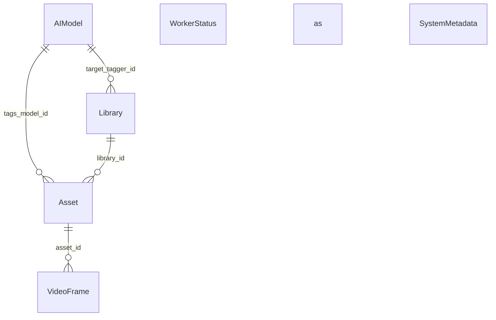

# MediaSearch API / Data Model User Guide

This document describes the MediaSearch **data model**: entities (tables), enums, and how they relate. The system uses PostgreSQL 16+ and is accessed via **repositories** and **workers**; there are no REST CRUD HTTP endpoints for these entities. The HTTP surface is intentionally small and UI-focused (see [UI User Guide](ui_user_guide.md)).

---

## UI HTTP endpoints

These endpoints are intended for the Mission Control / Search UI.

### GET /dashboard

Server-rendered HTML page (Jinja2) that hosts the search-first UI. Optional query parameter:

- `tag` (optional): Initial tag filter; on load the UI runs a tag-only search and shows results for that tag.
- `library` (optional, repeatable): Initial library filter; restricts results to the given library slugs.
- `type` (optional): Initial media type filter; `image` or `video` to restrict results.

### GET /dashboard/tag/{tag}

Same dashboard page with the given tag as initial filter (e.g. `/dashboard/tag/Disneyland`). Renders the same template as `/dashboard` with `initial_tag` set so the client runs a tag search on load. Useful for sharing or bookmarking “all assets with this tag”.

### GET /library

Library Browser page. Query parameters:

- `library` (optional): Initial library slug. When provided, assets for that library load on page load.
- `sort` (optional, default `date`): Sort field (`name`, `date`, `size`, `added`, `type`).
- `order` (optional, default `desc`): Sort direction (`asc` or `desc`).
- `type` (optional): Initial media type filter (`image` or `video`).

### GET /library/{library_slug}

Library Browser page with the given library pre-selected. Same template as `/library` with `initial_library` set. Query parameters `sort`, `order`, and `type` work as for `/library`.

### GET /api/library-assets

Pagination endpoint for Library Browser. Query parameters:

- `library` (required): Library slug.
- `sort` (optional, default `date`): Sort by `name`, `date`, `size`, `added`, or `type`.
- `order` (optional, default `desc`): `asc` or `desc`.
- `type` (optional): Filter to `image` and/or `video` (repeatable).
- `limit` (optional, default 50): Page size (1–200).
- `offset` (optional, default 0): Pagination offset.

Response: JSON object with `items` (array of asset objects shaped like search results) and `has_more` (boolean). Used for infinite scroll: when `has_more` is true, the client fetches the next page with `offset = items.length`.

### GET /api/search

Search endpoint used by the UI result grid. Query parameters:

- `q`: Semantic (“vibe”) full-text query.
- `ocr`: OCR-only full-text query.
- `tag` (optional): Filter by tag. When only `tag` is provided (no `q` or `ocr`), returns all assets that have that tag (tag-only search). Can be combined with `q` or `ocr` to restrict full-text results to that tag.
- `library_slug` (optional): Limit results to a library.
- `limit` (optional, default 50): Max results.

Response: JSON array of items with:

- `asset_id`, `type` (`image` | `video`)
- `thumbnail_url` (derivative URL)
- `preview_url` (animated preview WebP URL if available)
- `final_rank`
- `match_ratio` (percentage)
- `best_scene_ts` (formatted `MM:SS`)
- `best_scene_ts_seconds` (raw seconds; used for deep-linking behaviors)

### GET /api/asset/{asset_id}

Returns description, tags, and OCR text for a single asset (used by the detail modal). Query parameters:

- `best_scene_ts` (optional, float): For video assets, the scene start time in seconds. When provided, the response uses that scene’s metadata (e.g. `metadata->'moondream'`) instead of the asset’s `visual_analysis`.

Response: JSON object (`AssetDetailOut`) with:

- `description` (str | null)
- `tags` (list of str)
- `ocr_text` (str | null)
- `library_slug`, `filename` (for display)

Returns 404 if the asset does not exist or is in a deleted library.

### GET /media/...

Static file mount rooted at `data_dir`. This serves derivative media only (thumbnails, animated previews, scene JPEGs, etc.). It must never be used to expose or write to source libraries.

---

## Enums

Enums are stored as strings in the database.

| Enum | Values | Meaning |
|------|--------|---------|
| `ScanStatus` | `idle`, `full_scan_requested`, `fast_scan_requested`, `scanning` | Library scan state |
| `AssetType` | `image`, `video` | Type of media file |
| `AssetStatus` | `pending`, `processing`, `proxied`, `extracting`, `analyzing`, `completed`, `failed`, `poisoned` | Pipeline state for an asset |
| `WorkerState` | `idle`, `processing`, `paused`, `offline` | Worker runtime state |
| `WorkerCommand` | `none`, `pause`, `resume`, `shutdown`, `forensic_dump` | Command sent to a worker via `worker_status` |
| `SceneKeepReason` | `phash`, `temporal`, `forced` | Why a video scene was closed (analytics: visual drift, 30s ceiling, or EOF) |

---

## Entities (tables)

### AIModel

Registry of AI models used for tagging/analysis. Referenced by libraries (target tagger) and assets (which model produced current tags or analysis).

| Field | Type | Description |
|-------|------|-------------|
| `id` | int (PK) | Primary key |
| `name` | str | Model name (e.g. `mock-analyzer`, `clip`) |
| `version` | str | Model version |

**Unique constraint:** `(name, version)`.

---

### Library

A media library: a root path (e.g. NAS mount) and configuration for scanning and AI processing.

| Field | Type | Description |
|-------|------|-------------|
| `slug` | str (PK) | URL-safe unique identifier (e.g. `nas-main`) |
| `name` | str | Human-readable name |
| `absolute_path` | str | Physical path to library root |
| `is_active` | bool | Master “pause” switch |
| `scan_status` | ScanStatus | Current scan state |
| `target_tagger_id` | int? (FK → aimodel.id) | Target AI model for assets in this library; if null, the effective target is the system default (see SystemMetadata) |
| `sampling_limit` | int | Max frames per video (default 100) |
| `deleted_at` | datetime? | Soft-delete timestamp; non-null = in trash |

---

### Asset

A single media file (image or video) belonging to a library. Moves through pipeline states (pending → proxied → completed, etc.).

| Field | Type | Description |
|-------|------|-------------|
| `id` | int (PK) | Primary key |
| `library_id` | str (FK → library.slug) | Parent library |
| `rel_path` | str | Path relative to library root |
| `type` | AssetType | `image` or `video` |
| `mtime` | float | File mtime (Unix) for dirty checks |
| `size` | int | File size in bytes |
| `status` | AssetStatus | Pipeline status |
| `tags_model_id` | int? (FK → aimodel.id) | AI model that produced current tags |
| `analysis_model_id` | int? (FK → aimodel.id) | AI model that produced current visual analysis |
| `worker_id` | str? | Worker that has claimed this asset |
| `lease_expires_at` | datetime? | Claim expiry for recovery |
| `retry_count` | int | Incremented on claim; high count can lead to `poisoned` |
| `error_message` | str? | Last processing error if any |
| `visual_analysis` | jsonb? | Last vision result: description, tags, ocr_text (from analysis_model_id) |

**Unique constraint:** `(library_id, rel_path)`.

---

### VideoFrame

A frame extracted from a video asset; used for search and analysis.

| Field | Type | Description |
|-------|------|-------------|
| `id` | int (PK) | Primary key |
| `asset_id` | int (FK → asset.id) | Parent video asset |
| `timestamp_ms` | int | Offset in video (milliseconds) |
| `is_keyframe` | bool | True if from a native I-frame |
| `search_vector` | TSVector | Full-text search vector (PostgreSQL) |

---

### VideoScene

A closed scene from scene-based video indexing (one representative frame per scene). Used for resumable indexing and search.

| Field | Type | Description |
|-------|------|-------------|
| `id` | int (PK) | Primary key |
| `asset_id` | int (FK → asset.id) | Parent video asset |
| `start_ts` | float | Scene start time (seconds) |
| `end_ts` | float | Scene end time (seconds) |
| `description` | str? | AI-generated caption from vision model (e.g. Moondream2); nullable when no analyzer is used. |
| `metadata` | jsonb? | Optional: `moondream` (description, tags, ocr_text), `showinfo` (FFmpeg showinfo line), `semantic_duplicate` (true when description is very similar to previous scene). |
| `sharpness_score` | float | Laplacian variance of representative frame |
| `rep_frame_path` | str | Path relative to data_dir to the scene representative JPEG |
| `keep_reason` | SceneKeepReason | Why the scene closed: `phash`, `temporal`, or `forced` (EOF) |

---

### WorkerStatus

Per-worker registration and control. Standalone; no FK from other tables.

| Field | Type | Description |
|-------|------|-------------|
| `worker_id` | str (PK) | Unique worker identifier (e.g. hostname + UUID) |
| `last_seen_at` | datetime | Heartbeat timestamp |
| `state` | WorkerState | Current state |
| `command` | WorkerCommand | Command for worker to obey |
| `stats` | JSONB? | Optional heartbeat stats |

---

### SystemMetadata

Key/value store for system-wide settings. Holds `schema_version` and `default_ai_model_id` (the AIModel id used as the system default when a library's `target_tagger_id` is null). Standalone.

| Field | Type | Description |
|-------|------|-------------|
| `key` | str (PK) | Setting name |
| `value` | str | Setting value |

---

## Relationships

- **Library → Asset:** One library has many assets; asset has `library_id` → `library.slug`.
- **Asset → VideoFrame:** One (video) asset has many frames; frame has `asset_id` → `asset.id`.
- **AIModel:** Referenced by `Library.target_tagger_id` and `Asset.tags_model_id`. The effective target model for a library is the library's `target_tagger_id` if set, otherwise the system default from `system_metadata` (key `default_ai_model_id`).
- **WorkerStatus:** Standalone; workers update their row for heartbeat and commands.
- **SystemMetadata:** Standalone; used for schema version, default AI model id, and similar globals.

---

## Dashboard response models (UIRepository)

The Mission Control dashboard is backed by read-only queries that return structured data (not exposed as JSON HTTP APIs). The repository uses these Pydantic-style models:

- **SystemHealth** — `schema_version`, `db_status` (e.g. connected / error).
- **WorkerFleetItem** — `worker_id`, `state`, `version` (schema version).
- **LibraryStats** — `total_assets`, `pending_assets` (counts from `asset` table).

These feed the single HTML dashboard route; there are no REST endpoints that return these as JSON.
